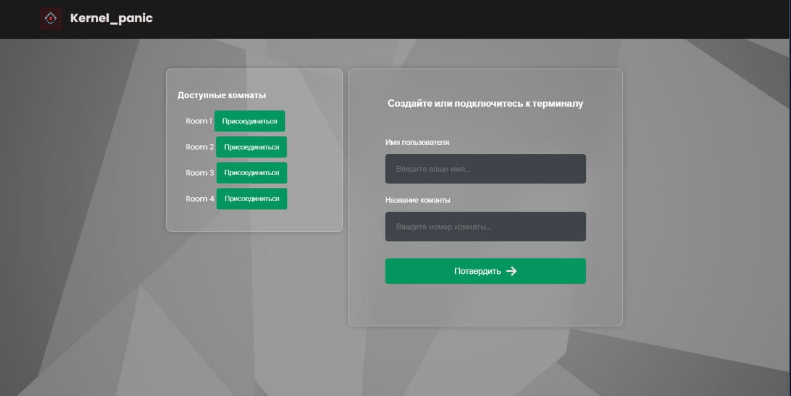

# Приложение для видеосвязи от команды *Kernel_panic*

Это приложение создано с использованием технологии WebRTC для обеспечения двусторонней связи между терминалом и менеджером. Оно написано с применением HTML, CSS и JavaScript.

## Основные особенности
- **WebRTC** позволяет напрямую соединять два или более браузеров через туннель, обеспечивая качественную передачу аудио и видео.
- Внедрение **Agora SDK** значительно расширяет функционал приложения.  
  **Agora SDK** — это набор инструментов, предоставляемый платформой Agora.io. С его помощью можно создавать приложения для видеозвонков, голосового общения, текстовых чатов, совместной работы и стриминга.

---

## Демонстрация работы приложения

### Первое изображение: Создание или подключение к комнате

На данном этапе пользователи могут:  
1. **Присоединиться к существующей комнате**.  
   При выборе кнопки «Присоединиться» терминал автоматически подключается к заранее зарезервированной комнате под именем `Терминал ID`.  
2. **Создать новую комнату**.  
   Для этого нужно ввести имя пользователя и название комнаты. После этого будет создана индивидуальная комната для общения.

### Второе изображение: Основной интерфейс приложения

Здесь представлен привычный интерфейс видеоконференций, который включает:  
1. **Чат** — для обмена текстовыми сообщениями между участниками.  
2. **Список участников** — отображает количество пользователей в комнате.  
3. **Главный экран** — показывает видео с веб-камеры и содержит элементы управления:  
   - включение/выключение микрофона;  
   - включение/выключение камеры;  
   - выход из комнаты.

---


# Руководство пользователя

Для использования этого приложения предусмотрено несколько способов запуска:

1. [Запуск и использование в локальной сети](#1-запуск-и-использование-в-локальной-сети)
2. [Запуск и использование в локальной сети (Radmin VPN)](#2-запуск-и-использование-в-локальной-сети-radmin-vpn)
3. [Запуск приложения с параллельным использованием ngrok](#3-запуск-приложения-с-параллельным-использованием-ngrok)
4. [Запуск приложения с использованием "Белого" IP адреса](#4-запуск-приложения-с-использованием-белого-ip-адреса)

---

## 1. Запуск и использование в локальной сети

1. Скачайте репозиторий.
2. Откройте корень репозитория в среде разработки **Visual Studio Code** с установленным аддоном *Live Server*.
3. Найдите файл `lobby.html` в корне репозитория. Нажмите ПКМ по файлу и выберите пункт **Open with Live Server**.
4. Откроется сайт, где будет предложено ввести имя пользователя и название комнаты. После нажатия кнопки **Подтвердить** создается комната. Приложение запросит разрешение на использование камеры и микрофона.
5. Для просмотра терминалов начните поиск комнат в левом меню для автоматического открытия комнаты.

---

## 2. Запуск и использование в локальной сети (Radmin VPN)

1. Установите **Radmin VPN** на все устройства, которые будут участвовать в видеосвязи.
2. Создайте новую виртуальную частную сеть (VPN) или подключитесь к существующей. Убедитесь, что все устройства подключены к одной VPN-сети через **Radmin VPN**.
3. Скачайте репозиторий.
4. Откройте корень репозитория в среде разработки **Visual Studio Code** с установленным аддоном *Live Server*.
5. Найдите файл `lobby.html` в корне репозитория. Нажмите ПКМ по файлу и выберите пункт **Open with Live Server**.
6. Откроется сайт, где будет предложено ввести имя пользователя и название комнаты. После нажатия кнопки **Подтвердить** создается комната. Приложение запросит разрешение на использование камеры и микрофона.
7. Для просмотра терминалов начните поиск комнат в левом меню для автоматического открытия комнаты.

---

## 3. Запуск приложения с параллельным использованием ngrok

1. Установите **ngrok**.
2. Авторизуйтесь в **ngrok**.
3. Скачайте репозиторий.
4. Откройте корень репозитория в среде разработки **Visual Studio Code** с установленным аддоном *Live Server*.
5. Найдите файл `lobby.html` в корне репозитория. Нажмите ПКМ по файлу и выберите пункт **Open with Live Server**.
6. В командной строке, где запущен ngrok, введите команду:  
   ```bash
   ngrok http 5502
   Это запустит туннель **ngrok**.  
7. Скопировать HTTPS-ссылку из графы **Forwarding**.  
   Например: `https://a946-146-120-197-115.ngrok-free.app`.  
8. Открыть скопированную ссылку в браузере и нажать **Visit Site**.  
9. На открывшейся странице выбрать `lobby.html`, нажав на неё ЛКМ.  
10. Откроется сайт, где будет предложено ввести имя пользователя и комнату. После нажатия кнопки «Подтвердить» будет создана комната, и приложение запросит разрешение на использование камеры и микрофона.  
11. Для просмотра терминалов необходимо нажать на список комнат слева, чтобы автоматически открыть нужную комнату.

---

## 4. Запуск приложения с использованием "Белого" IP адреса

1. Скачать репозиторий.  
2. Открыть корень репозитория в среде разработки **Visual Studio Code** с установленным аддоном **Live Server**.  
3. Найти файл `lobby.html` в корне репозитория, нажать ПКМ по файлу и выбрать пункт **Open with Live Server**.  
4. Откроется сайт, где будет предложено ввести имя пользователя и комнату. После нажатия кнопки «Подтвердить» будет создана комната, и приложение запросит разрешение на использование камеры и микрофона.  
5. Для просмотра терминалов необходимо нажать на список комнат слева, чтобы автоматически открыть нужную комнату.  
6. Так как у вас есть "Белый" IP адрес, к вам смогут подключаться пользователи из любой точки планеты! :)


## Преимущества приложения

### 1. **Удобство использования**
- **Простой интерфейс**: Приложение имеет интуитивно понятный дизайн, что позволяет быстро освоиться даже пользователям без технических знаний.
- **Легкий запуск**: Несколько способов развертывания (локальная сеть, VPN, ngrok, "Белый" IP) обеспечивают гибкость и удобство использования.

### 2. **Высокое качество связи**
- **Технология WebRTC**: Обеспечивает стабильное соединение и низкую задержку для видеосвязи и передачи данных.
- **Интеграция с Agora SDK**: Улучшает качество видео и звука, добавляет поддержку масштабируемого стриминга и видеоконференций.

### 3. **Гибкость настройки**
- Возможность подключения как в локальной сети, так и через удаленный доступ.
- Поддержка различных инфраструктур: VPN (Radmin VPN), туннелирование (ngrok), "Белый" IP.

### 4. **Кроссплатформенность**
- Приложение работает в браузере, что исключает необходимость установки дополнительных программ на устройствах пользователей.
- Совместимость с основными операционными системами: Windows, macOS, Linux и даже мобильными устройствами.

### 5. **Безопасность**
- **Шифрование данных**: Использование протоколов WebRTC обеспечивает безопасный обмен аудио, видео и текстовыми сообщениями.

### 6. **Дополнительные функции**
- **Чат**: Встроенный текстовый чат для обмена сообщениями.
- **Список участников**: Позволяет видеть всех подключенных пользователей.
- **Управление устройствами**: Легкое включение/выключение камеры и микрофона для каждого пользователя.

### 7. **Готовность к масштабированию**
- Приложение подходит как для личного использования (создание небольших комнат), так и для бизнеса (масштабные конференции с десятками участников).


Эти преимущества делают приложение эффективным инструментом для видеосвязи, подходящим как для личных, так и для профессиональных задач.
